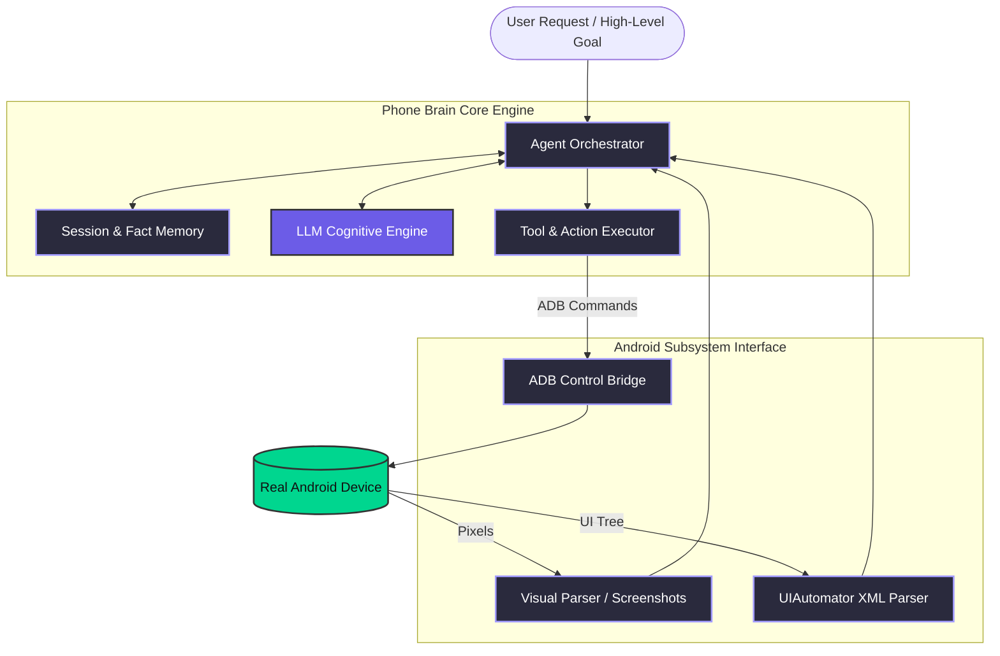

# 🌟 Phone Brain  
**The Elite AI-Powered Android Automation Agent**

*Autonomous, context-aware, and highly adaptive Android device control.*

---

## 📖 Executive Overview

**Phone Brain** is an advanced, autonomous AI automation agent engineered to interact with real Android devices dynamically. Moving far beyond traditional rigid scripts and fragile macro recorders, Phone Brain mirrors the cognitive processes of a human user. 

By unifying **raw visual perception** (screenshots & CV techniques) with **structural code interpretation** (Android UIAutomator hierarchies), Phone Brain possesses deep contextual awareness. Before every tap, swipe, or keystroke, the agent executes a comprehensive internal reasoning loop—mapping sub-goals, identifying UI elements robustly, validating screen states, and verifying execution success.

Whether applied to complex end-to-end mobile testing, intelligent digital assistants, or high-volume workflow automation, Phone Brain delivers unmatched resilience in the Android ecosystem.

---

## 🚀 Core Architectural Capabilities

### 🧠 Deep Cognitive Reasoning Loop
At the core of the system is a specialized reasoning engine. The AI does not blindly execute tasks. Instead, it follows a strict operational loop:
1. **Screen Analysis:** "What app am I in? What is the current UI state?"
2. **Goal Tracking:** "What is the global objective? Are we progressing or blocked?"
3. **Action Planning:** "Which exact UI node represents the next logical step?"
4. **Risk Assessment:** "Are there destructive consequences to this action (e.g., deletions, purchases)? Is the screen still loading?"

### 👁️ Dual-Modality Perception Engine
Our hybrid perception architecture guarantees robust element targeting regardless of custom wrappers, WebViews, or gaming overlays:
- **Visual Input:** Parses screenshots to understand spatial orientation, dynamic loading states, image-based icons, and visual cues (highlighted/grayed out).
- **DOM/UI Hierarchy:** Ingests XML accessibility trees (UIAutomator). Extracted metadata includes text, content-descriptions, resource-ids, and interactivity flags (clickable, scrollable).

### 🛠️ Semantic Targeting Protocol (STP)
Phone Brain abstracts away the fragility of absolute coordinates. It employs a strict targeting hierarchy to guarantee test script stability across any device resolution:
1. **Semantic Text:** Targets explicit user-visible text.
2. **Content Description:** Targets accessibility labels (e.g., hidden icon descriptions).
3. **Resource-ID:** Targets underlying developer element IDs (`com.app:id/submit`).
4. **Calculated Bounds:** Only as a last resort, computes the perfect center `[x,y]` coordinates mapped directly from the dynamic UI DOM bounding boxes.

### ⚡ Autonomous Adaptive Recovery
The agent intelligently handles edge cases that break conventional scripts:
- Automatically detects and dismisses GDPR consent forms, ad overlays, and update dialogues.
- Employs self-healing search techniques, autonomously scrolling to find off-screen elements.
- Implements exponential back-offs and verification checks (waiting for loading spinners to resolve).

---

## 🏗️ System Architecture

---

## 💼 Application & Use Cases (CV Highlights)
- **Next-Gen QA & QA Automation:** Eliminates fragile Appium maintenance overhead through self-healing dynamic test generation and execution.
- **RPA (Robotic Process Automation):** Automates complex, multi-app workflows that lack API support natively on the device.
- **Data Extraction & Web Scraping:** Navigates infinite scrolls, paginations, and complex application logic to retrieve structured data from native Mobile environments.
- **Autonomous Digital Assistants:** Enables entirely voice-prompted or text-prompted device control for complex enterprise operations.

---

## 🛠️ Technology Stack
- **AI/Cognitive Core:** Advanced LLM Integration via API (e.g., Google Gemini 2.0 / OpenAI GPT-4 Vision).
- **Backend/Orchestration:** Python (Async, High-Performance execution).
- **Device Bridge:** Android Debug Bridge (ADB), UIAutomator.
- **Web UI & Visualization:** Socket.io, VanillaJS, Custom CSS (Dark Mode Glassmorphism) for real-time inference monitoring.

---

  
<b>Built with precision. Engineered for resilience.</b>

